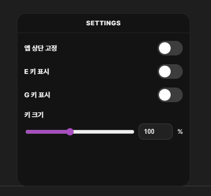

# keyviewer

Tauri + React로 만든 고정형 키뷰어입니다.  
`W`, `A`, `S`, `D`, `Space`를 기본으로 표시하고, 설정창에서 `E`, `G`를 추가로 켤 수 있습니다.

## Features

- 고정형 keyviewer 레이아웃
- 투명 배경, 무테두리 창
- 창 아무 곳이나 드래그 이동 가능
- 전역 키 입력 감지
- 현재 창이 포커스된 상태에서도 키 반응 표시
- `Ctrl + Alt + Shift + K`로 설정창 열기
- 설정값 저장
  - 앱 상단 고정
  - 키 크기
  - `E` 키 표시
  - `G` 키 표시

## Stack

- React 19
- Vite
- Tauri 2
- Rust
